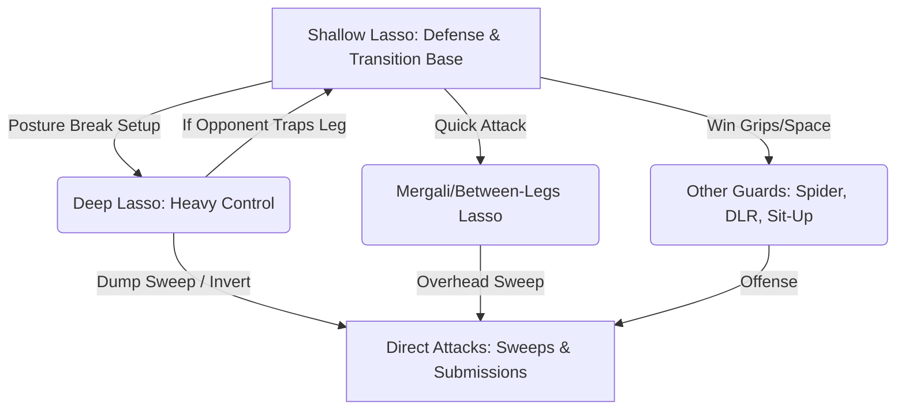

+++
title = "Guards"
tags = [ "bottom", "guard", "lasso", "mount" ]
date = 2025-10-30T23:58:20+01:00
pre = "<i class='fa fa-broom'></i> "
weight = 2
+++

## Half Guard

### Deep Half Guard
#### Videos

1. Technique

* [3 Very Efficient Sweeps From Deep Half Guard](https://youtu.be/ojvH99btFYo) by Bernardo Faria
* [Deep Half Guard Techniques](https://youtu.be/idxIDIxS99Q) by Knight Jiu-Jitsu
* [3 Useful Options for Deep Half](https://youtu.be/Y4qzY740Tyg) by Knight Jiu-Jitsu
* [The main sweep to know from half guard](https://youtu.be/pW2YL_n8Q_U) by Lachlan Giles

2. Defense

* [Three options to defend deep half guard](https://youtu.be/JEDoJOZWQHY?si=wIsBv21s5CK9xyfh) by Leonel Marra

3. Refinement

* [Half Guard Overview](https://youtu.be/2X3niTOljyk) by Jonathan Thomas

## Lasso Guard

The core difference in application comes down to whether your primary goal is **Defense/Transition** (Shallow Lasso) or **Direct Attack/Heavy Control** (Deep Lasso).

Here is a breakdown of when to use each:

### 1. When to Use the Shallow Lasso

The **Shallow Lasso** involves applying the hook only above the opponent's bicep or placing the foot on their shoulder. It is characterized as a very good defensive position and a versatile open guard.

You should use the Shallow Lasso when:

* **You need distance and defense:** The shallow foot placement allows you to push the opponent far away to create space. This is critical for recovering your guard if your opponent is attempting to smash you or has trapped your bottom leg.
* **You are setting up transitions:** The Shallow Lasso is excellent for winning the initial grip fight and acting as a base from which you can transition. It buys time to change your grips (e.g., from a sleeve to a collar) before moving to other guards like the Spider Guard, De La Riva, or Sit-Up Guard.
*   **You want to maintain a squared position:** This variation typically requires you to stay square with the opponent.
* **You plan to attack with a non-lasso technique:** Since the shallow lasso controls the position, many practitioners use it to *unlasso* and then immediately shoot for a triangle, omoplata, or De La Riva hook.

### 2. When to Use the Deep Lasso

The **Deep Lasso** requires shooting the leg deeply, all the way to the armpit, with the foot landing on the opponent's back or far shoulder. This is the classic version most people think of when they hear "lasso".

You should use the Deep Lasso when:

* **You want maximum posture control:** This deep insertion controls the opponent's whole body. By putting your full shin parallel to the ground, you drive heavy weight into the opponent's arm and break their posture.
*   **You are aiming for a direct, high-leverage sweep:** The Deep Lasso is often used as an immediate attack series. It is the setup for the "classic deep lasso sweep" that involves dumping the opponent sideways.
* **You plan to invert:** The Deep Lasso offers opportunities to invert through for submissions like omoplatas.

If you start with a **Shallow Lasso**, it is always easy to transition to a **Deep Lasso** if the setup is right. However, if you start deep and the opponent traps your leg, it can be tricky to get your leg back out.

### Notes
* When performing the lasso, position your knuckles over your thigh. If the opponent tries to pull his arm, rotate your wrist to reduce strain in your fingers

[Study Guide on NotebookLM](https://notebooklm.google.com/notebook/dc647494-a22f-4c2a-9294-fb00cf61fd92)

1. Technique

* [Deep Lasso vs Shallow Lasso](https://youtu.be/EZ_xB_lCTgg) by Jonathan Thomas
* [Detailed Breakdown of the Leg Lasso Guard](https://youtu.be/Xi9QoQ2hBtE) by Stephan Kesting

2. Refinement

* [How To Lasso Hook Sweep Everyone](https://youtu.be/5oBfjCxqe3Y) by Bernardo Faria

3. Fights
* [Rikako Yuasa vs Rayanne Amanda / World Championship 2017](https://youtu.be/2jRTNsveesg)

* [Mayssa Bastos VS Rikako Yuasa / World Championship 2019](https://youtu.be/ClKfa3dR3kg)
